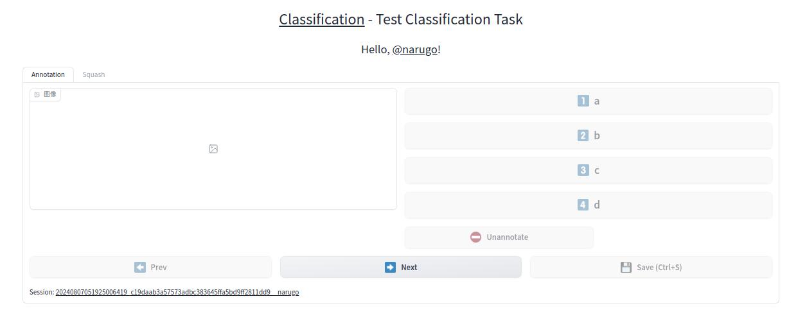

# felinewhisker

[](https://pypi.org/project/felinewhisker/)


[](https://github.com/deepghs/felinewhisker/actions?query=workflow%3A%22Code+Test%22)
[](https://github.com/deepghs/felinewhisker/actions?query=workflow%3A%22Package+Release%22)
[](https://codecov.io/gh/deepghs/felinewhisker)


[](https://github.com/deepghs/felinewhisker/stargazers)
[](https://github.com/deepghs/felinewhisker/network)

[](https://github.com/deepghs/felinewhisker/issues)
[](https://github.com/deepghs/felinewhisker/pulls)
[](https://github.com/deepghs/felinewhisker/graphs/contributors)
[](https://github.com/deepghs/felinewhisker/blob/master/LICENSE)

Smart Data Annotator for Computer Vision Training Tasks, As Smart As Tom's Whisker :)

(**WIP currently!!! WIP currently!!! WIP currently!!!** Most of the features are still not stable,
this readme is just a guide for those who really willing to experience the state-of-art features, and API/CLI will
probably get breaking changed at any time before the v0.0.1 version is formally released, just keep followed.)

Currently, support classification dataset, more task types (multi-label, object detection, regression, composed) will be supported via plugin system afterwards.

## Install

```shell
git clone https://github.com/deepghs/felinewhisker.git
cd felinewhisker
pip install .
```

## Quick Start

### Initialize Dataset

Initialize a dataset on HuggingFace repository

```shell
# initialize on repository your/hf_repo
# labels are 'a', 'b', 'c' and 'd'
# task name is 'Test Classification Task'
python -m felinewhisker init classification -r your/hf_repo -l a,b,c,d -n 'Test Classification Task'
```

Initialize a dataset on local directory

```shell
# initialize on directory /your/dataset/path
python -m felinewhisker init classification -d /your/dataset/path -l a,b,c,d -n 'Test Classification Task'
```

Note: These 2 types of datasets are guaranteed to be 100% the same. You can simply migrate it by uploading/downloading
it from/to HuggingFace.

### Start Annotator WebUI

We provide gradio-based WebUI for you to doing annotations.

You can load your images from your local disk or some other data sources (e.g. gelbooru, danbooru)

#### Use Local Directory As Data Source

```python
from felinewhisker.datasource import LocalDataSource
from felinewhisker.repository import HfOnlineRepository
from felinewhisker.ui import create_annotator_app

# when using online repository, make sure you have set 
# the HF_TOKEN env with the write permission to this repository, 
# and the repository should already be initialized via the above-mentioned command
repo = HfOnlineRepository('your/hf_repo')

# load images from local directory '/data/images/dir'
datasource = LocalDataSource('/data/images/dir')

if __name__ == '__main__':
    with create_annotator_app(
            repo=repo,
            datasource=datasource,
            annotation_options=dict(
                # you can use hotkeys you like when doing annotations
                # hotkey_maps=['a', 'b', 'c', 'd', 'e'],
            ),
    ) as demo:
        demo.launch(server_port=7860)

```

Your will see the WebUI like this on `http://127.0.0.1:7860`



The hotkeys including:

* `Left Arrow`: Previous Image.
* `Right Arrow`: Next Image / Start Annotation.
* `Ctrl + S`: Save Currently Annotated Samples.
* `Esc`: Unannotated This Sample.
* `Others`: Annotate Image With A Label. Default is `1-9A-Z`, you can customize it via `hotkey_maps` option. These is
  just for classification task, should be different in other task types.

When you save the current annotation, a data package with a parquet file (to record the samples and annotations) and a
tar archive file (to store the image files) will be created and added into the dataset repository. **But these samples
are not usable currently, it will be available after you squash them into the main data parquet.**

#### Use Other Data Source

You can use gelbooru data source by replacing the variable `datasource`'s assignment with the following code

Note: Remember to get granted by huggingface repository deepghs/gelbooru-webp-4Mpixel first and set the HF_TOKEN env
with read permission of it, or you will not be able to access the data inside.

```python
from cheesechaser.datapool import GelbooruWebpDataPool
from cheesechaser.query import GelbooruIdQuery

from felinewhisker.datasource import CheeseChaserDataSource

# use gelbooru webp data source
# powered by cheesechaser library:
# and huggingface repository: https://huggingface.co/datasets/deepghs/gelbooru-webp-4Mpixel
db_pool = GelbooruWebpDataPool()
ids = GelbooruIdQuery(  # query from gelbooru with these tags
    ['arknights', '1girl', 'solo', '-loli', '-monochrome', 'rating:s', 'sort:random'],
)
datasource = CheeseChaserDataSource(db_pool, id_generator=ids, source_id='gelbooru')
```

#### Use An Annotation Assistant

Something we can speedup the annotation by using an annotation assistant (e.g. the last version of model you just
trained / some classic-CV-based rough algorithm).

```python
from PIL import Image

from felinewhisker.datasource import LocalDataSource
from felinewhisker.repository import HfOnlineRepository
from felinewhisker.ui import create_annotator_app

repo = HfOnlineRepository('your/hf_repo')
datasource = LocalDataSource('/data/images/dir')


def your_prediction_func(image_file: str):
    image = Image.open(image_file)
    # doing something
    return 'label'  # return a valid annotation value


if __name__ == '__main__':
    with create_annotator_app(
            repo=repo,
            datasource=datasource,
            fn_annotate_assist=your_prediction_func,
            annotation_options=dict(
                # you can use hotkeys you like when doing annotations
                # hotkey_maps=['a', 'b', 'c', 'd', 'e'],
            ),
    ) as demo:
        demo.launch(server_port=7860)


```

#### Squash Them

Enter the `Squash` tab, you will see the main sample table (contains all available samples) and unarchived table (
contains all unsquashed samples). You can squash them just by clicking the `Squash` button.

#### How to Collaborate With Multiple Annotators

Don't try to collaborate by just opening one WebUI service.

For each collaborator, he/she should open a WebUI service on own work environment, and all the collaborators should
using the same dataset repository (e.g. use a local repository on nfs / use the same HF repository).

The unsquashed annotation data of different sessions will be saved with different names, and you can squash all of them
at one time.

Besides, if you are using HF-based online repository, you can trace the edition history of all the contributors. And can
rollback the unwanted changes by `hfutils rollback` command.

#### Load Dataset on Torch's Dataloader

(WIP, but plan to support)

